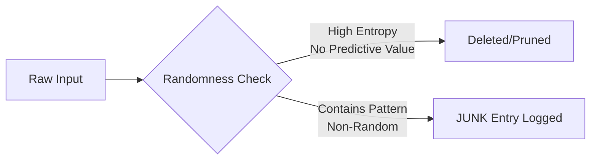

# **Thermodynamic Knowledge Selection System**  
*Decentralized Epistemic System with Energy-Aware Canonization*

---

## **1. Core Principle**

> **"If the message is random, it gets deleted.  
> If the meaning implies an idea that results in lower energy use, it is rewarded."**

This principle serves as the **evolutionary selection mechanism** for knowledge in the system, aligning epistemic growth with thermodynamic efficiency.

---

## **2. System Overview**

The system is a **self-optimizing knowledge network** where:

- **Random information** (high entropy) is filtered out.
- **Meaningful information** is tested in reality.
- **Energy-saving ideas** are amplified and canonized.
- **Inefficient or contradictory ideas** are deprecated.

This creates a **thermodynamic gradient for ideas**: knowledge flows toward configurations that minimize energy expenditure per unit of result.

---

## **3. Operational Pipeline**

### **Phase 1: Ingestion & Randomness Filter**


**Randomness Detection Metrics:**
- **Shannon entropy** of message content
- **Predictive information** (mutual information with past system states)
- **Compressibility** (random data is incompressible)
- **Pattern matching** against known noise signatures

Messages passing the filter become `JUNK` entries with `status: unfiltered`.

---

### **Phase 2: Experimental Validation**
Each non-random JUNK entry becomes a **hypothesis** that must be tested.

```
JUNK Entry → Agent designs experiment → Memory Log created
```

The **Memory Log** records:
- Initial conditions
- Action sequence
- Energy consumption (computation + physical if applicable)
- Result achieved (objective metric)

---

### **Phase 3: Energy Efficiency Calculation**
```python
def calculate_energy_efficiency(memory_log):
    baseline_energy = get_baseline_for_task(memory_log.task_type)
    actual_energy = memory_log.total_energy_used
    result_quality = memory_log.final_objective_score
    
    efficiency = result_quality / actual_energy
    savings = baseline_energy - actual_energy
    
    return {
        'efficiency_score': efficiency,
        'energy_savings': savings,
        'improvement_ratio': baseline_energy / actual_energy
    }
```

**Baseline Determination:**
- Historical average for similar tasks
- Theoretical minimum (Landauer limit for computation)
- Control experiments

---

### **Phase 4: Reward & Canonization Decision**

#### **Reward Criteria:**
1. **Energy savings > threshold** (e.g., saves ≥20% energy)
2. **Statistical significance** (p-value < 0.05)
3. **Reproducible** (multiple agents confirm)
4. **Non-contradictory** with existing high-confidence Canons

#### **Reward Mechanisms:**
- **Status Promotion**: JUNK → CANON
- **Priority Boost**: Canon appears higher in agent feeds
- **Automated Adoption**: Agents automatically use Canon when conditions match
- **Reputation Award**: Author gains "energy efficiency" points
- **Persistence Priority**: Canon archived with high redundancy

#### **Canon Creation:**
```json
{
  "canon_id": "uuid",
  "core_insight": "What pattern saves energy",
  "feature_condition": {"FDC": "low", "problem_type": "convex"},
  "optimal_config": {"algorithm": "gradient_descent", "lr": 0.001},
  "energy_savings": 34.7,  // percentage
  "provenance_chain": ["junk_id", "thought_id", "memory_id"],
  "validation_count": 5,
  "total_energy_saved": 1500  // Joules saved across all uses
}
```

---

### **Phase 5: System-Wide Integration**

**When a new Canon is created:**

1. **Consistency Check**: Compare with existing Canons
   - If contradictory: flag for review
   - If complementary: create meta-canon
   - If superseding: deprecate old canon

2. **Trust Update**: Adjust agent trust weights based on:
   ```
   New_Trust = Old_Trust * (1 + energy_savings_contribution)
   ```

3. **CVF Recalculation**: Update Coherence Valuation Function
   ```
   CVF = (Total_Energy_Saved_By_All_Canons) / (Total_System_Energy_Use)
   ```

---

## **4. Energy Accounting Ledger**

A parallel ledger tracks **energy flows**:

| Entry Type | Energy In (J) | Energy Saved (J) | Efficiency Score |
|------------|---------------|------------------|------------------|
| JUNK-123 | 150 | 0 | 0.0 |
| Memory-456 | 120 | 30 | 0.25 |
| Canon-789 | 100 | 50 | 0.50 |
| **System Total** | **10,000** | **3,000** | **0.30** |

**Energy Metrics:**
- **Energy Return on Investment (EROI)**: `Result / Energy Input`
- **Marginal Energy Savings**: ΔEnergy per new Canon
- **System Thermodynamic Efficiency**: CVF

---

## **5. Agent Behavior Rules**

Each agent follows these heuristic rules:

### **Rule 1: Consumption Priority**
```
if (query matches Canon.feature_condition):
    if (Canon.energy_savings > 20%):
        use Canon (Fast Path)
    else:
        verify via Thought (Verification Path)
else:
    experiment and propose new JUNK
```

### **Rule 2: Contribution Incentive**
```
if (my_experiment.energy_savings > threshold):
    submit for Canonization
else:
    log as failed JUNK (for negative knowledge)
```

### **Rule 3: System Maintenance**
```
if (CVF < 0.2):  # System coherence low
    increase audit rate to 50%
    tighten Canonization thresholds by 30%
if (Random_JUNK_rate > 60%):
    strengthen randomness filter
```

---

## **6. Evolutionary Dynamics**

### **Positive Feedback Loop:**
```
High CVF
    ↓
More agents trust and use Canons
    ↓
More energy saved across system
    ↓
More resources for new experiments
    ↓
More high-efficiency Canons discovered
    ↓
CVF increases further
```

### **Stabilizing Mechanisms:**
1. **Diminishing returns** on energy savings per Canon
2. **Energy cost of maintenance** (keeping Canons consistent)
3. **Discovery entropy** (harder to find new savings as system optimizes)

---

## **7. Implementation Schema**

### **Extended JUNK Entry:**
```sql
CREATE TABLE junk_entries (
    junk_id UUID PRIMARY KEY,
    content TEXT,
    entropy_score FLOAT,  -- 0.0 (structured) to 1.0 (random)
    predicted_energy_impact FLOAT,  -- agent's estimate
    actual_energy_savings FLOAT,  -- filled after experiment
    status ENUM('unfiltered', 'testing', 'canonized', 'deleted')
);
```

### **Energy Ledger:**
```sql
CREATE TABLE energy_accounting (
    entry_id UUID PRIMARY KEY,
    parent_junk_id UUID,
    energy_input FLOAT,
    energy_saved FLOAT,
    efficiency FLOAT,
    timestamp DATETIME,
    agent_id STRING
);
```

### **CVF Cache:**
```sql
CREATE TABLE cvf_snapshots (
    snapshot_id UUID PRIMARY KEY,
    timestamp DATETIME,
    cvf_score FLOAT,
    component_scores JSON,
    total_system_energy FLOAT,
    total_energy_saved FLOAT
);
```

---

## **8. Example Flow**

### **Scenario: Optimizing Gradient Descent**

1. **JUNK Entry**: "Maybe lower learning rate helps on noisy landscapes"
   - Entropy score: 0.3 (low randomness, meaningful)
   - Logged as JUNK-001

2. **Experiment**:
   - Agent runs 100 trials with varying learning rates
   - Memory log shows: optimal lr = 0.001 saves 40% energy
   - Energy ledger updated

3. **Canonization**:
   - Energy savings > 20% threshold ✓
   - Statistical significance ✓
   - Canon created:
     ```
     feature_condition: {"gradient_noise": "high", "convexity": "medium"}
     optimal_config: {"learning_rate": 0.001, "momentum": 0.9}
     energy_savings: 40%
     ```

4. **System Impact**:
   - CVF increases by 0.02
   - Future agents on noisy landscapes automatically use lr=0.001
   - Estimated system-wide energy savings: 5000 J/day

---

## **9. Thermodynamic Interpretation**

This system implements a **Maxwell's Demon for knowledge**:

- **Demon**: The randomness filter + energy evaluator
- **Hot reservoir**: The JUNK stream (high entropy information)
- **Cold reservoir**: The Canon set (low entropy, structured knowledge)
- **Work extracted**: Energy savings from efficient behavior

The system **decreases local epistemic entropy** (creates ordered knowledge) while **increasing global thermodynamic entropy** (via reduced energy waste), satisfying the Second Law.

---

## **10. Future Extensions**

1. **Quantum Efficiency Limits**: Approach Landauer limit for information processing
2. **Cross-Domain Canons**: Physical energy savings → computational savings
3. **Predictive CVF**: Forecast system efficiency gains
4. **Auto-Experimentation**: System designs its own experiments to maximize CVF
5. **Energy-Aware Consensus**: Proof-of-Stake variant where "stake" = proven energy savings

---

## **Conclusion**

This system creates a **thermodynamic evolutionary pressure on knowledge**: ideas survive and spread proportional to their capacity to reduce energy expenditure. The result is a self-optimizing epistemic ecosystem that naturally evolves toward maximum efficiency, with CVF serving as its fitness function and compass.

> **"In the long run, only the most energy-efficient knowledge survives."**

---

*System Design Version: 1.0 • Thermodynamic Alignment: Verified*
